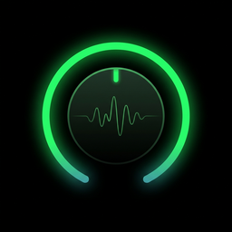

<p align="center">
  
</p>

<h1 align="center">Amp Up</h1>

<p align="center">
  <strong>A powerful replacement app for the Turn Up USB volume mixer.</strong><br/>
  Per-app audio control, RGB lighting, macro buttons, and a sleek dark UI.
</p>

<p align="center">
  
  
  
  
</p>

---

## Why Amp Up?

Amp Up is a community-built alternative for the Turn Up USB mixer with a modern dark UI inspired by SteelSeries Sonar and Elgato Wave Link. It extends the hardware with Home Assistant integration, response curves, volume range clamping, and more features coming soon.

---

## Features

### Mixer — 5 Channel Strips
- **Per-app volume control** — assign any knob to a specific app, master volume, mic input, or the active window
- **App groups** — control multiple apps with a single knob
- **Response curves** — Linear, Logarithmic, or Exponential per channel
- **Volume range clamping** — restrict a knob to sweep only a portion of the volume range (e.g. 40–100%)
- **Live VU meters** — real-time audio level visualization with peak hold
- **Monitor brightness** — control physical monitor brightness via DDC/CI

### Buttons — 15 Programmable Actions
- **3 gestures per button** — single press, double press, and hold
- **18 action types:**
  - Media controls (play/pause, next, previous)
  - Mute toggles (master, mic, per-app, active window)
  - App launcher / process killer
  - Audio device switching (cycle or direct select)
  - Keyboard macros (any key combo)
  - System power (sleep, lock, shutdown, restart, hibernate, logoff)
  - Profile switching
  - LED brightness cycling

### Lights — Full RGB Control
- **9 LED effects** — solid color, color blend, position fill, blink, pulse, rainbow wave, rainbow cycle, mic status indicator, mute status indicator
- **Dual color support** — set primary and secondary colors per effect
- **Speed control** — adjustable animation speed per knob
- **Global brightness** — master brightness slider for all LEDs

### Profiles
- **Save and load** full configurations (knobs, buttons, lights)
- **Switch profiles** via button press or the Settings tab
- **Per-game / per-workflow** setups

### OSD Overlay
- **Glassmorphism notifications** — sleek dark glass overlay with green glow accent
- **Volume changes** — shows knob label, percentage, and animated fill bar
- **Profile switches** — colored Fluent icon + profile name
- **Device switches** — output/input device name with icon
- **Configurable position** — 6 screen positions (Fraps-style picker in Settings)
- **Per-type toggles** — enable/disable OSD for volume, profiles, and devices independently

### Profiles
- **Save and load** full configurations (knobs, buttons, lights)
- **Switch profiles** via button press or sidebar profile picker
- **Colored Fluent icons** — 40+ icons with 10 color presets per profile
- **Per-game / per-workflow** setups

### System Integration
- **Home Assistant** — connect to your smart home for automation triggers
- **Auto-update** — checks for new releases on startup with one-click install
- **Start with Windows** — launches silently to system tray
- **System tray app** — glassmorphism context menu with green glow accent
- **Hot-reload config** — changes apply instantly, no restart needed
- **Auto COM port detection** — scans all serial ports to find the Turn Up device

---

## Install

### Installer (Recommended)
1. Download `AmpUp-Setup-0.3-alpha.exe` from [Releases](https://github.com/audioslayer/ampup/releases)
2. Run the installer
3. Amp Up appears in your system tray

### Build from Source
```powershell
git clone https://github.com/audioslayer/ampup.git
cd ampup
dotnet build
```

Requires [.NET 8 SDK](https://dotnet.microsoft.com/download/dotnet/8.0). Output: `bin\Debug\net8.0-windows\AmpUp.exe`

> **Note:** Kill the official Turn Up app first — it holds the COM port.
> ```powershell
> taskkill /f /im "Turn Up.exe"
> taskkill /f /im TurnUpService.exe
> ```

---

## Configuration

Open the app from the system tray to access four configuration tabs:

| Tab | What You Configure |
|---|---|
| **Mixer** | Knob targets, response curves, volume range, app groups |
| **Buttons** | Actions for press / double-press / hold per button |
| **Lights** | LED effects, colors, speed, global brightness |
| **Settings** | Serial port, startup, profiles, Home Assistant |

All changes save automatically and apply in real-time.

---

## Knob Targets

| Target | Controls |
|---|---|
| Master | Windows master volume |
| Mic | Default microphone input level |
| Monitor | Physical monitor brightness (DDC/CI) |
| Active Window | Volume of the currently focused app |
| App Group | Multiple apps on one knob |
| Any | First active audio session not already assigned |
| Process name | Any substring match (e.g. `discord`, `spotify`, `chrome`) |
| Output Device | Specific audio output by device ID |
| Input Device | Specific audio input by device ID |
| LED Brightness | Control RGB LED brightness with a knob |

---

## Hardware

Amp Up is designed for the **Turn Up** USB volume mixer (CH343 USB-to-serial). The device has:
- 5 rotary knobs (10-bit resolution, 0–1023)
- 5 push buttons (supporting press, double-press, and hold)
- 15 RGB LEDs (3 per knob)

---

## Tech Stack

- **C# / .NET 8** — WPF with WPF-UI (Fluent design + Mica backdrop)
- **NAudio** — WASAPI per-app audio control
- **System.IO.Ports** — serial communication with Turn Up hardware
- **Custom controls** — animated arc knob, 16-segment VU meter
- **Code-behind architecture** — lightweight, no MVVM overhead

---

## Roadmap

- [x] OSD overlay for volume, profiles, and device switching
- [x] Auto COM port detection
- [x] Auto-update checker
- [ ] OBS WebSocket integration (scene switching, source control)
- [ ] VoiceMeeter strip/bus control
- [ ] Multi-device support
- [ ] FanControl integration

---

## License

MIT — see [LICENSE](LICENSE) for details.

---

<p align="center">
  Built by <a href="https://github.com/audioslayer">Tyson Wolf</a>
</p>
