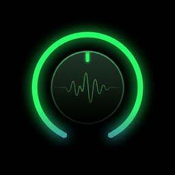

<p align="center">
  
</p>

<h1 align="center">Amp Up</h1>

<p align="center">
  Modern Windows control software for the original Turn Up USB volume mixer,<br />
  with native support for the TreasLin / VSDinside N3 stream controller.
</p>

<p align="center">
  
  
  
  
</p>

<p align="center">
  <a href="#install">Install</a> ·
  <a href="#supported-hardware">Hardware</a> ·
  <a href="#features">Features</a> ·
  <a href="#integrations">Integrations</a> ·
  <a href="#build-from-source">Build</a> ·
  <a href="https://github.com/audioslayer/ampup/issues">Issues</a>
</p>

Amp Up replaces the original Turn Up desktop software with a fast, modern WPF application. It maps physical controls to Windows audio, apps, profiles, lighting, macros, devices, and automations while keeping the original mixer responsive and useful as a daily driver.

The original **Turn Up mixer is the primary supported device**. Amp Up can also operate a TreasLin / VSDinside N3 natively, either by itself or alongside the Turn Up.

## Install

1. Open the [latest Amp Up release](https://github.com/audioslayer/ampup/releases/latest).
2. Download the `AmpUp-Setup-{version}.exe` installer.
3. Run the installer and launch Amp Up.
4. Connect the Turn Up mixer, N3 stream controller, or both.

The Windows installer is self-contained, so users do not need to install the .NET runtime separately.

> [!IMPORTANT]
> Close the official Turn Up application before starting Amp Up. Only one application can own the Turn Up serial port at a time.

### In-app updates

After the first install, future releases can be installed without visiting GitHub. Amp Up downloads the matching installer, verifies its GitHub-reported size and SHA-256 digest, exits cleanly, installs the update after the normal Windows elevation prompt, and relaunches itself.

Updates can be started from the version label, **Settings → Check for Updates**, or the tray update banner.

## Supported hardware

| Device | Status | Support |
| --- | --- | --- |
| **Original Turn Up USB mixer** | Stable / primary | 5 knobs, 5 buttons, 15 RGB LEDs, native CH343 serial protocol, profiles, app groups, actions, and lighting |
| **TreasLin / VSDinside N3** | Beta | 6 LCD keys, 3 side buttons, 3 rotary encoders with press, native HID, pages, Spaces, dynamic displays, and sleep/wake |

Amp Up supports **Turn Up only**, **Stream Controller only**, and **Both** hardware modes. The N3 driver is built in; VSD Craft, OpenDeck, and other helper applications are not required for normal use.

The experimental macOS port has been discontinued. Current releases support **64-bit Windows 10 and Windows 11**.

## Features

### Windows audio and mixer control

- Control master output, microphone input, individual apps, app groups, active-window audio, and specific input/output devices.
- Match traditional desktop apps, games, browsers, UWP apps, and sessions whose display name differs from their process name.
- Apply linear, logarithmic, or exponential response curves with custom minimum and maximum volume ranges.
- Use live VU meters, peak activity, mute state, and a unified tray mixer without opening the main window.
- Detect newly connected, removed, or changed Windows audio devices while Amp Up remains open—including Bluetooth endpoints.
- Cycle all eligible devices or a user-selected subset, with unavailable selections retained until the device returns.

### Buttons, profiles, and automation

- Assign tap, double-press, and hold actions to each Turn Up button.
- Use media, mute, app, device, profile, macro, URL, text, screenshot, power, integration, toggle, and multi-action commands.
- Build profiles, import/export configurations, back up settings, and switch profiles manually or by foreground application.
- Automatically duck selected apps when a voice or priority application becomes active.
- Show volume, profile, and device OSD notifications on a chosen monitor.
- Open a radial Quick Wheel for fast profile or output-device selection.

### Turn Up RGB lighting

- Drive all 15 LEDs directly with per-knob or room-wide Scenes.
- Choose from more than 60 static, animated, audio-reactive, position-aware, and state-aware effects.
- Edit gradients and palettes, brightness, speed, effect direction, and per-channel gamma calibration.
- Use app-status lighting for running, muted, unmuted, and activity states.
- Combine the active output-device color with physical knob position using **Dev+Pos** mode.
- Preview effects on the hardware while browsing the effect library.

### N3 stream controller

- Design six LCD keys with titles, icons, custom images, colors, glow, text placement, and display modes.
- Organize actions into pages and Spaces, with Home navigation and automatic Back keys.
- Configure side buttons and encoder presses with tap, double-press, and hold gestures.
- Use encoder rotation for volume-style targets, page navigation, or Space navigation.
- Display clocks, dynamic mute/streaming/playback states, Spotify now-playing art, and hardware metrics.
- Render CPU, GPU, RAM, VRAM, temperature, usage, and fan gauges with configurable limits and colors.
- Use smooth scrolling titles, animated displays, native sleep/wake, and automatic reconnect behavior.

### Room lighting

- Synchronize Govee, Corsair iCUE, and Turn Up lighting from one Room workspace.
- Use static and animated room effects, Music Reactive, VU Fill, Screen Sync, and Game Mode.
- Place devices on a room layout and map screen regions spatially.
- Control brightness, palettes, direction, temperature, device groups, and per-device participation.
- Support Govee LAN control, cloud-only devices, and compatible RGBIC segment effects.

### Reliability and performance

- Dedicated ordered input workers keep slow button actions from blocking Turn Up or N3 device reads.
- High-frequency absolute knob events are coalesced so stale input cannot build a latency backlog.
- Serial stall detection reconnects the Turn Up if its USB stream stops responding.
- Audio-session and RGB refresh paths are non-reentrant and clean up Windows audio resources deterministically.
- Runtime logs rotate automatically, repeated offline-device messages are rate-limited, and failed Spotify refresh credentials stop retrying continuously.

## Integrations

| Integration | What Amp Up supports |
| --- | --- |
| **SignalRGB** | Free localhost bridge for Turn Up LEDs, layouts, effect actions, blackout/restore, and profile sync without surrendering the serial port |
| **Govee** | LAN and Cloud devices, scenes, brightness, color, temperature, groups, RGBIC segments, room effects, and screen/music sync |
| **Corsair iCUE** | Room lighting, static and reactive effects, device sync, and supported fan/pump controls |
| **Home Assistant** | Entity actions and controls from hardware buttons, knobs, and N3 keys |
| **OBS Studio** | Streaming/recording actions and dynamic N3 status displays |
| **VoiceMeeter** | Strip and bus gain targets when VoiceMeeter is installed and enabled |
| **Spotify** | Playback actions, session restore, track state, and N3 now-playing artwork |
| **Discord RPC** | Mute, deafen, voice-state, leave-channel, and noise-suppression actions; authorization remains tester-gated pending public Discord approval |

Integration credentials and Amp Up configuration are stored locally under `%APPDATA%\AmpUp`.

## What changed in 1.3

Version 1.3 focuses on everyday reliability and update delivery:

- Added live Windows audio-device detection so newly connected Bluetooth and USB endpoints appear without restarting Amp Up.
- Reworked Turn Up and N3 input processing to prevent stalled controls, delayed button actions, and stale knob-event backlogs.
- Added serial read-stall recovery, cleaner hardware-mode scanning, and safer RGB refresh behavior.
- Fixed recurring resource leaks and refresh contention across Windows audio sessions, tray rows, HTTP integrations, Govee UDP, and process handles.
- Added log rotation and rate limiting for repeated offline/error conditions.
- Prevented invalid Spotify refresh credentials from retrying every few seconds.
- Added the verified one-click in-app updater and connected the tray banner directly to it.

See [CHANGELOG.md](CHANGELOG.md) for the complete release history.

## Configuration and logs

Amp Up keeps user data outside the installation directory:

| Data | Location |
| --- | --- |
| Configuration and profiles | `%APPDATA%\AmpUp` |
| Runtime log | `%APPDATA%\AmpUp\ampup.log` |
| Previous rotated log | `%APPDATA%\AmpUp\ampup.previous.log` |
| Downloaded update staging | `%TEMP%\AmpUp\Updates\{version}` |

## Troubleshooting

### Turn Up is not detected

- Close the official Turn Up app and any other software that may have opened its COM port.
- Unplug and reconnect the mixer, then allow a few seconds for Windows to restore the CH343 serial device.
- Check **Settings → Connection** if the configured port differs from the detected port.

### A Bluetooth or USB audio device is missing

- Confirm Windows shows the endpoint as connected and enabled.
- Allow a moment for Amp Up's debounced device refresh.
- Reopen the device picker if it was already expanded when the endpoint changed.

### Controls stop responding or the app reports an error

Include the following when opening a [GitHub issue](https://github.com/audioslayer/ampup/issues):

- Amp Up version
- Windows version
- Connected controller(s)
- Steps that reproduce the problem
- Relevant lines from `%APPDATA%\AmpUp\ampup.log`

Review logs before posting if they contain device or application names you prefer not to share.

## Build from source

### Requirements

- Windows 10 or Windows 11
- [.NET 8 SDK](https://dotnet.microsoft.com/download/dotnet/8.0)
- [Inno Setup 6](https://jrsoftware.org/isinfo.php) only when building the installer

### Build and run

```powershell
git clone https://github.com/audioslayer/ampup.git
Set-Location ampup
dotnet build AmpUp.sln -c Debug
dotnet run --project AmpUp.csproj
```

### Build the installer

```powershell
.\build-installer.bat
```

The script publishes a self-contained `win-x64` build and creates:

```text
installer\output\AmpUp-Setup-{version}.exe
```

The version comes from `AmpUp.csproj`. For the in-app updater to recognize a release, its Git tag and installer filename must use the same version—for example, tag `v1.4` with `AmpUp-Setup-1.4.exe`.

## Project structure

| Path | Purpose |
| --- | --- |
| `AmpUp.Core/` | Shared models, configuration, serial/HID protocols, RGB engine, services, and integrations |
| `App.xaml.cs` | Application startup, hardware orchestration, profiles, integrations, tray, OSD, and runtime coordination |
| `AudioMixer.cs` | Windows Core Audio sessions, endpoints, peaks, mute, and volume targets |
| `ButtonHandler.cs` | Gesture recognition and action execution |
| `Views/` | Mixer, Buttons, Lights, Room, Overview, OSD, and Settings pages |
| `Controls/` | Custom WPF controls, tray mixer, action pickers, N3 tiles, effects, and editors |
| `installer/` | Inno Setup definition and generated installer output |

## Contributing

Bug reports and feature requests are welcome in [GitHub Issues](https://github.com/audioslayer/ampup/issues). Before submitting a change, build both configurations and keep unrelated local edits out of the commit:

```powershell
dotnet build AmpUp.sln -c Debug
dotnet build AmpUp.sln -c Release
```

---

<p align="center">
  Built by <a href="https://github.com/audioslayer">audio</a><br />
  <a href="https://www.buymeacoffee.com/audioslayer">Buy me a coffee</a>
</p>
